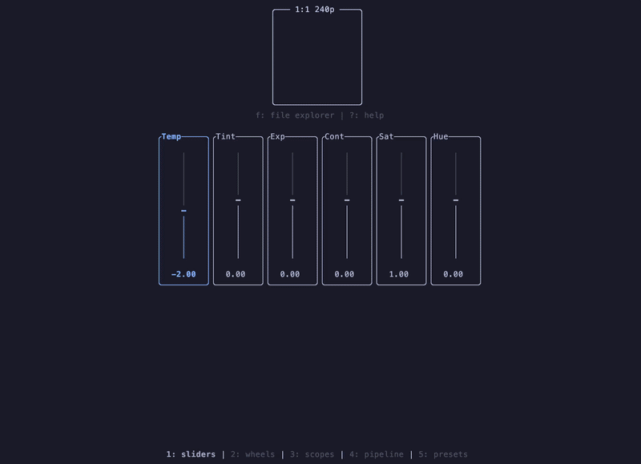

# clgrade

A terminal based image color grading application written in Rust using [Ratatui](https://github.com/ratatui/ratatui).



## Installation
Make sure you have [Rust and Cargo](https://www.rust-lang.org/tools/install) installed:

```bash
cargo install --git https://github.com/cladamos/clgrade.git
```

## Usage
You can open an image directly from the command line:

```bash
clgrade path/to/image.png
```

Or start without arguments and use the built-in file explorer:

```bash
clgrade
```

> **Supported Formats**: `png`, `jpg`, `jpeg`, `webp`


### Key Bindings
Press `?` inside the application anytime to view the help modal.

| Section | Key | Action |
| :--- | :--- | :--- |
| **Navigation** | `1` - `5` | Switch pages (Sliders, Wheels, Scopes, Pipeline, Presets) |
| | `Tab` | Switch active tool / control |
| | `?` | Toggle help overlay |
| | `o` | Toggle layout (Horizontal / Vertical) |
| | `q` / `Ctrl+c` | Quit application |
| **Adjustments** | `↑` / `k`, `↓` / `j` | Increase / Decrease value |
| | `←` / `h`, `→` / `l` | Adjust left / right (e.g. wheels, balance) |
| | `r` | Reset selected tool |
| | `R` | Reset all adjustments |
| | `Ctrl+z` / `u` | Undo |
| | `Ctrl+r` | Redo |
| **Preview** | `Space` *(hold)* | View original image |
| | `p` | Toggle proxy mode |
| | `a` / `A` | Change aspect ratio / resolution |
| **File & Presets** | `f` | Toggle file explorer |
| | `Enter` | Select file / load preset |
| | `Ctrl+s` | Open export directory picker |
| | `s` | Confirm export / save preset |
| | `Del` / `d` | Delete preset |
